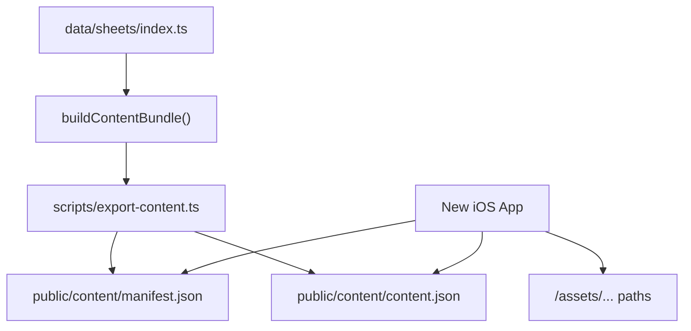

# iOS App Design Requirements Plan

## Scope
- Add a new markdown requirements file at `[docs/ios-app-design-requirements.md](docs/ios-app-design-requirements.md)`; create `docs/` if needed.
- Base the requirements on the actual content backend: `[lib/sheet-schema.ts](lib/sheet-schema.ts)`, `[lib/content-bundle.ts](lib/content-bundle.ts)`, `[scripts/export-content.ts](scripts/export-content.ts)`, and the deployed static JSON paths `/content/manifest.json` and `/content/content.json`.
- Use the existing SwiftUI app as implementation context, especially `[ios/LogicProCheatSheets/LogicProCheatSheets/Services/ContentSyncService.swift](ios/LogicProCheatSheets/LogicProCheatSheets/Services/ContentSyncService.swift)`, `[Models/ContentModels.swift](ios/LogicProCheatSheets/LogicProCheatSheets/Models/ContentModels.swift)`, and `[Views/SectionView.swift](ios/LogicProCheatSheets/LogicProCheatSheets/Views/SectionView.swift)`.

## Document Content
- Product goal: native offline-ready Logic Pro.Guru handbook for recording, mixing, mastering, and DAW reference chapters.
- Backend/API contract: `ContentManifest`, `ContentBundle`, `ContentNavItem`, `CheatSheet`, section types, content versioning, SHA-256 verification, `minAppVersion`, and schema compatibility.
- Data flow: app fetches manifest, compares versions, downloads bundle, verifies hash, decodes JSON, caches verified content, and falls back to bundled seed content.
- UX requirements: chapter browsing, native detail pages, previous/next navigation, home/intro screen, refresh/status messaging, plugin chooser filters, table/card/checklist/chain/image rendering.
- Asset requirements: resolve root-relative `/assets/...` paths against the configurable remote base URL; support remote image loading and cached/offline image behavior for sheet images and plugin images.
- Non-functional requirements: offline-first behavior, graceful failures, accessibility, Dynamic Type, iPad split view, configurable base URL, forward-compatible unknown section handling, and privacy/no-login expectations.
- Acceptance criteria: concrete checks for JSON compatibility, sync behavior, offline launch, rendering parity, and image support.

## Known Backend Facts To Capture

## Commit And Push
- After the plan is approved and the markdown file is created, commit only the new requirements document and push to the main branch, leaving existing unrelated modified files untouched.